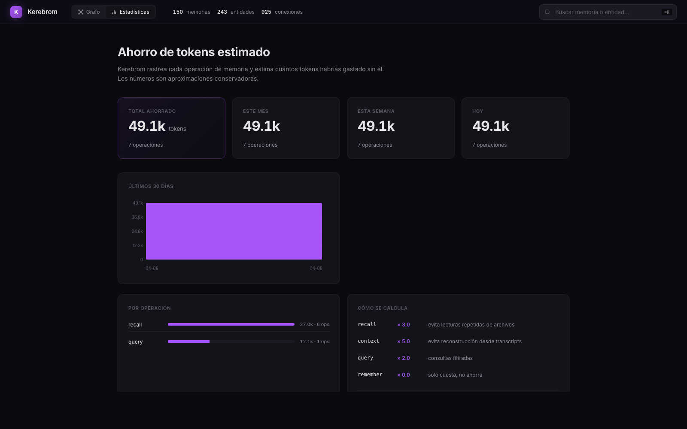
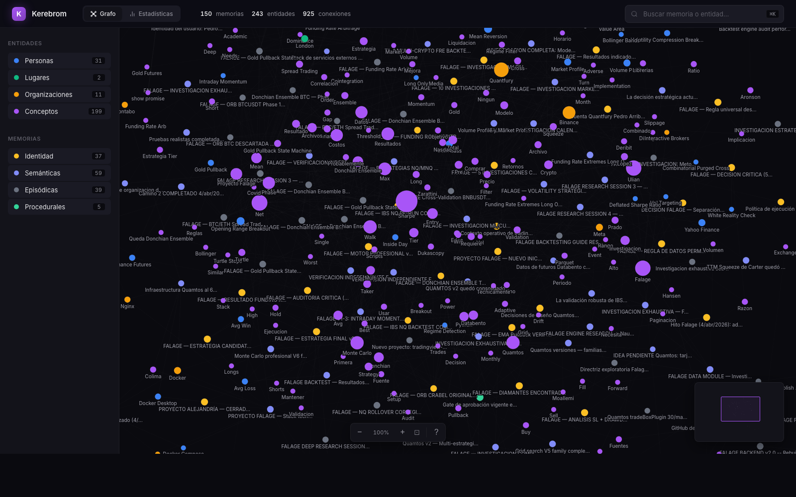

# Kerebrom

[Read in English](README.md)

> **Memoria persistente local para herramientas de AI.**
> Claude y Codex dejan de preguntarte lo mismo dos veces. Tus proyectos mantienen contexto. Dejas de sangrar tokens.

**Sin nube. Sin API keys. Nada sale de tu máquina.** Solo un archivo SQLite que Claude Code, Codex y Claude Desktop comparten como un cerebro a largo plazo.



---

## Por qué importa

Cada asistente AI de código olvida. Cada conversación nueva empieza desde cero. Re-explicas tu proyecto, tus preferencias, tus decisiones. Vuelven a leer los mismos archivos. Pagas tokens por contexto que el modelo debería ya saber.

Kerebrom lo arregla. Un cerebro persistente compartido entre tus AI tools, **corriendo 100% en tu máquina**.

### Impacto medido

Números reales de `kerebrom benchmark` sobre un proyecto con 150 memorias (abril 2026):

| Métrica | Valor |
|---|---|
| Latencia promedio de recall | **60ms** |
| Tokens input por query | **~15** |
| Tokens output por recall | **~2,400** |
| **Ratio de ahorro estimado** | **~500×** |

> El ahorro es una **estimación conservadora**, no una medición A/B exacta. El multiplicador (recall × 3.0) asume que sin Kerebrom el modelo tendría que releer ~3× más contenido para encontrar la misma información. El ahorro real depende del tamaño de tu proyecto y de cuánto reutilices contexto.

Repróducelo tú:

```bash
kerebrom benchmark --queries 10 --output mi-benchmark.json
```

---

## Instalación

```bash
git clone https://github.com/ulianbass/kerebrom.git
cd kerebrom
pip install .
kerebrom setup
```

`kerebrom setup` auto-detecta Claude Code, Claude Desktop y Codex en tu máquina y registra a Kerebrom como servidor MCP en cada uno. Es idempotente — puedes correrlo en cualquier momento para reparar configs.

---

## Lo que obtienes

### Para cada AI tool
- **Un cerebro compartido.** Claude aprende algo, Codex lo sabe la próxima vez.
- **Persistente entre reinicios.** Nada vive en la ventana del chat.
- **Auto-consolidación.** Un agente programado (Sopor) lee tus transcripts y los destila en memorias estructuradas — nunca copia tus palabras literalmente, siempre reescribe como hechos.

### Para tu privacidad
- **100% local.** Un archivo SQLite en `~/.kerebrom/kerebrom.db`. Nada sale a ningún lado.
- **Limpieza de datos sensibles.** API keys, emails y patrones de PII conocidos se redactan antes de guardarse.
- **Cifrado opcional en reposo.** AES-256 vía `openssl` del sistema.

### Para tu cartera
- **Token tracking incluido.** Cada `recall`, `context` y `query` se cuenta.
- **Dashboard de estadísticas.** Abre `kerebrom graph` para ver tokens ahorrados por día, por operación y acumulados.
- **Benchmarks reproducibles.** `kerebrom benchmark` exporta JSON que puedes publicar.

### Para tu cerebro
- **Grafo de conocimiento interactivo.** Visualización D3-force de cada entidad y memoria en tu base de datos, con filtros, búsqueda, zoom y click para enfocar.
- **Consultas estructuradas.** Filtra por `kind`, `tags`, `importance`, rangos de fecha y metadata JSON arbitraria.
- **Inferencia de entidades.** Personas, lugares, organizaciones y conceptos se clasifican automáticamente.

---

## Comandos

```bash
kerebrom setup              # configurar AI tools (idempotente)
kerebrom serve              # iniciar servidor MCP sobre stdio
kerebrom graph              # abrir el grafo interactivo + dashboard de stats

kerebrom remember "…"       # guardar una memoria intencionalmente
kerebrom recall "query"     # búsqueda híbrida (semántica + keyword + grafo)
kerebrom context "query"    # paquete de divulgación progresiva
kerebrom query --kind core  # filtros estructurados
kerebrom facts              # listar tripletas semánticas
kerebrom entities           # listar personas, lugares, conceptos
kerebrom gaps               # listar huecos de conocimiento

kerebrom stats              # reporte de ahorro de tokens en terminal
kerebrom benchmark          # correr benchmark medible
kerebrom sopor              # consolidar transcripts manualmente

kerebrom snapshot           # backup portable .kbk
kerebrom revive             # restaurar desde .kbk
kerebrom uninstall          # eliminar todo
```

---

## El grafo interactivo



## El dashboard de stats

Cuando corres `kerebrom graph`, la UI web tiene dos tabs:

**Grafo** — visualización interactiva D3-force de tu grafo de memoria:
- Coloreado por tipo (persona, lugar, organización, concepto, tipo de memoria)
- Búsqueda, filtros, zoom, minimap, atajos de teclado (⌘K, Esc, F, ?)
- Click en un nodo para ver sus memorias y conexiones
- Evitación automática de solape de etiquetas

**Estadísticas** — dashboard en vivo de lo que Kerebrom te está ahorrando:
- 4 stat cards: total ahorrado, este mes, esta semana, hoy
- Gráfico de barras SVG de los últimos 30 días (sin librerías externas)
- Desglose por operación (recall, context, query, remember)
- Caja transparente que explica cada multiplicador

---

## Arquitectura

```
~/.kerebrom/
  kerebrom.db          archivo SQLite único (memorias, entidades, hechos,
                       embeddings, token_stats)
  reports/             reportes de mantenimiento de Sopor versionados
  backups/             snapshots .kbk versionados
  Kerebrom.app/        bundle macOS para el LaunchAgent de auto-reparación
```

Cada herramienta (Claude Code, Claude Desktop, Codex) se conecta al mismo servidor MCP y ve la misma base de datos. No hay sync, no hay servidor, no hay nube — es un archivo.

### La capa de auto-reparación

En macOS, `kerebrom setup` instala un LaunchAgent que periódicamente se asegura de que las configs MCP sigan registradas. Si Claude Code reescribe `settings.json` o una actualización rompe una config, el agente la restaura automáticamente. Sin cron, sin Docker, sin systemd.

### Sopor — el agente de consolidación

Sopor corre como tarea programada dentro de Claude Code **y** como automatización dentro de Codex. Ambas versiones comparten un prompt genérico que:

1. Lee transcripts recientes de `~/.claude/projects` y `~/.codex/sessions`
2. **Destila** ideas — nunca copia las palabras del usuario literalmente
3. Valida cada idea contra el filtro "¿importará en 30 días?"
4. Fusiona memorias parciales en versiones unificadas más fuertes
5. Escribe un reporte en `~/.kerebrom/reports/`

El prompt se instala automáticamente con `kerebrom setup` — nada que configurar.

---

## Límites honestos

- **"Tokens ahorrados" es una estimación.** Usa multiplicadores conservadores por operación (recall × 3, context × 5, query × 2). No es una medición A/B. El dashboard, la salida de stats y el reporte de benchmark lo dicen explícitamente.
- **Los embeddings caen a hash** si no tienes `onnxruntime` o `sentence-transformers` instalados. Los hash embeddings son deterministas pero no capturan similitud semántica tan bien. Instala `onnxruntime` para embeddings neurales locales.
- **El modo cifrado usa `openssl` del sistema**, no SQLCipher. Mientras un proceso usa la DB activamente, existe un archivo temporal en texto plano en `/tmp`.
- **Sopor corre en Claude Code y Codex.** Si no usas ninguno, la consolidación es manual (`kerebrom sopor --all`).
- **macOS es el target principal.** Linux y Windows funcionan para el motor core y el servidor MCP, pero el LaunchAgent de auto-reparación es solo macOS.

---

## Tests

```bash
python3 -m pytest tests/test_kerebrom.py
```

111 tests cubren el store, servidor MCP, setup, token tracker, consolidación de Sopor, backup/restore y cifrado.

---

## Autor

Creado por **Ulian Bass** — Pedro Julián Arribas Monzón.

Copyright © 2026 Ulian Bass. Todos los derechos reservados.

## Licencia

Proprietary — el código es público para auditoría y uso local. Ver [LICENSE](LICENSE) para los términos.
