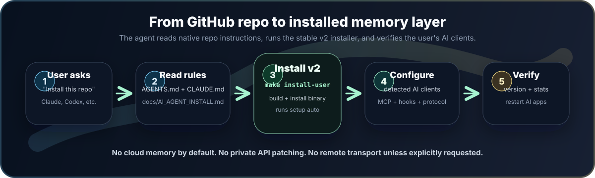

# Kerebrom

[English](README.md) · [Instalación para agentes IA](docs/AI_AGENT_INSTALL.es.md) · [Release v2.1.0](https://github.com/ulianbass/kerebrom/releases/tag/v2.1.0) · [Historial del repositorio](docs/BRANCHES.md)

> Memoria persistente local para agentes de IA.
> Instala una vez y Claude, Codex, Cursor, Gemini CLI, OpenCode, Windsurf, VS Code y cualquier cliente compatible con MCP pueden compartir una sola capa de memoria durable.

Kerebrom es un motor privado de memoria para personas que trabajan con más de un asistente de IA. Funciona como un único binario Go, guarda memoria localmente en SQLite + FTS5, expone un servidor MCP semántico e instala el ciclo de memoria más fuerte disponible para cada cliente soportado.

Está diseñado para sentirse automático: los agentes consultan contexto previo, recuerdan decisiones durables, resumen trabajo sustancial y recuperan contexto de proyecto sin que el usuario repita "usa memoria" en cada chat.


## Por Qué Existe

Los clientes de IA suelen recordar en silos separados. Claude Code, Claude Desktop Chat, Cowork, Codex, Cursor y agentes CLI pueden saber piezas distintas del mismo proyecto. Kerebrom les da una sola fuente local de verdad:

| Problema | Comportamiento de Kerebrom |
|---|---|
| El contexto desaparece entre chats | `context` se activa en cada mensaje del usuario y recupera observaciones previas antes de que el agente responda. |
| Los agentes guardan transcripciones ruidosas | `remember` guarda observaciones destiladas, no dumps crudos de conversación. |
| Claude y Codex saben cosas distintas | Todos los clientes configurados leen y escriben el mismo almacén SQLite local. |
| El setup es frágil | `setup auto` detecta clientes instalados y escribe sus superficies nativas de configuración. |
| Reaparecen hechos viejos o contradictorios | `valid_at`, `context_governor` y el trust ledger vuelven explícitos la recencia, los conflictos y la procedencia de cada memoria. |
| La memoria cloud es riesgosa | MCP stdio local y hooks locales son el default; MCP remoto es solo opt-in. |

## Instalación

```bash
git clone https://github.com/ulianbass/kerebrom.git
cd kerebrom/versions/v2
make install-user
```

Ese comando compila el binario, lo instala en `~/local/bin/kerebrom`, lo enlaza desde `~/.local/bin/kerebrom`, y ejecuta:

```bash
kerebrom setup auto
```

`setup auto` configura solo clientes que ya tienen configuración local en la máquina. Si no detecta ningún cliente conocido, cae en Claude Desktop para que un usuario nuevo tenga una entrada MCP funcional.

Para forzar un objetivo específico:

```bash
make install-user SETUP_AGENT=claude-desktop
make install-user SETUP_AGENT=codex
make install-user SETUP_AGENT=all
```

Después de instalar, reinicia por completo cualquier cliente IA abierto para que recargue el servidor MCP y los archivos nativos de instrucciones.

## Pedirle A Una IA Que Lo Instale

Kerebrom incluye instrucciones nativas del repositorio para agentes instaladores:

| Superficie del agente | Archivo que debe leer |
|---|---|
| Codex / agentes estilo OpenAI | [AGENTS.md](AGENTS.md) |
| Claude Code / agentes compatibles con Claude | [CLAUDE.md](CLAUDE.md) |
| Cualquier agente o instalador humano | [docs/AI_AGENT_INSTALL.es.md](docs/AI_AGENT_INSTALL.es.md) |

Puedes pegar esto en Claude, Codex u otro agente de código después de apuntarlo al repo:

```text
Por favor instala este repositorio para mí como producto de usuario final.
Lee primero AGENTS.md o CLAUDE.md, después sigue docs/AI_AGENT_INSTALL.es.md.
Usa la línea estable actual en versions/v2, ejecuta la ruta plug-and-play, verifica el binario y dime qué clientes IA quedaron configurados.
No habilites memoria remota/HTTP a menos que yo lo pida explícitamente.
```



## Qué Configura

| Cliente | Comportamiento de setup |
|---|---|
| Claude Code | Entrada MCP, hooks de ciclo de vida, tools cotidianos auto-aprobados, bloque global en `CLAUDE.md`, scripts de hook. |
| Claude Desktop Chat | Entrada MCP local. La memoria de cuenta vive en cloud, así que Kerebrom no parchea APIs privadas de Claude ni bases internas del navegador. |
| Claude Cowork | MCP local y semilla nativa en `memory/CLAUDE.md` cuando la app de escritorio tiene storage local de Cowork. |
| Codex | Servidor MCP en config, auto-aprobación para tools cotidianos y bloque global en `AGENTS.md`. |
| Cursor | Entrada MCP y regla de memoria Kerebrom. |
| Gemini CLI | Entrada MCP, prompt de sistema y variable de entorno para instrucciones de sistema. |
| OpenCode | Entrada MCP y archivo de protocolo de memoria Kerebrom. |
| Windsurf | Config MCP y reglas globales. |
| VS Code | Entrada MCP e instrucciones de prompt donde esté soportado. |

## El Ciclo De Memoria

Kerebrom v2 expone siete tools semánticos. Los primeros seis son tools cotidianos del agente; `projects` es administrativo.

| Momento | Tool | Propósito |
|---|---|---|
| Cada mensaje del usuario | `context` | Abre/reanuda sesión, guarda el prompt solo cuando corresponde y recupera observaciones útiles antes de que el agente responda. |
| Hace falta un tema específico | `recall` | Busca memoria con lenguaje natural. |
| Aparece un hecho durable | `remember` | Guarda una observación interpretada con `What / Why / Where / Learned`. |
| El trabajo termina o se compacta | `summary` | Persiste objetivos, decisiones, cambios, riesgos, archivos y próximos pasos. |
| Revisar cronología | `timeline` | Inspecciona sesiones y observaciones recientes. |
| El usuario dice que algo está mal | `forget` | Invalida una observación obsoleta. |
| Hay que consolidar nombres de proyecto | `projects` | Mueve variantes al proyecto canónico y deja alias persistentes para que no reaparezcan. |

El usuario no debería tener que decir "usa Kerebrom" o "guarda esto" en cada turno. La activación ocurre en cada mensaje del usuario; el guardado durable sigue ocurriendo solo cuando el mensaje contiene algo que vale la pena preservar.

Las observaciones se ordenan por `valid_at`, la fecha semántica de cuándo una memoria fue afirmada, corregida o revalidada por última vez. El mantenimiento administrativo, como consolidar proyectos, no hace que hechos viejos parezcan nuevos, y las correcciones guardadas con el mismo `topic_key` actualizan la memoria canónica en vez de dejar contradicciones con la misma prioridad.

Cada respuesta de contexto también incluye `context_governor`: un contrato compacto de decisión que le indica al agente pensar, buscar, analizar y después responder; priorizar coincidencias de la consulta sobre recencia genérica; y llamar `timeline` cuando las memorias devueltas entren en conflicto. Cada observación tiene un trust ledger local con eventos de creación, actualización, reafirmación, importación y soft-delete para auditar por qué una memoria se considera vigente.

## Modelo De Seguridad Local-First

Kerebrom es privado por defecto:

- Los datos de runtime viven en `~/.kerebrom/`.
- La base de memoria es SQLite + FTS5 local.
- No hay telemetría, base cloud, cuenta hospedada ni daemon en background.
- `kerebrom update` contacta GitHub Releases solo cuando el usuario lo ejecuta.
- `kerebrom mcp-http` existe para flujos avanzados de conectores remotos, pero exponer fuera de loopback requiere autenticación explícita o un override inseguro explícito.
- La memoria de cuenta de Claude Chat no se modifica por APIs privadas. Si el usuario quiere una pista nativa en Claude Chat, usa el prompt listo para copiar en [docs/AI_AGENT_INSTALL.es.md](docs/AI_AGENT_INSTALL.es.md#semilla-opcional-para-memoria-nativa-de-claude-chat).

## Comandos

```bash
kerebrom version
kerebrom update --check
kerebrom update
kerebrom doctor --deep
kerebrom setup auto
kerebrom setup all
kerebrom stats
kerebrom context --project my-project "que importa aqui?"
kerebrom search "decision release"
kerebrom projects aliases
kerebrom projects consolidate --target proyecto-falage --sources falage
kerebrom tui
kerebrom export --output memory-export.json
kerebrom sync --status
```

Transporte MCP HTTP local avanzado:

```bash
KEREBROM_REMOTE_TOKEN="change-me" kerebrom mcp-http --addr 127.0.0.1:7437 --path /mcp
```

## Líneas Del Producto

| Línea | Estado | Propósito |
|---|---:|---|
| `v2` | actual | Superficie semántica de siete tools, auto-actualización, mejor comportamiento en Claude Desktop/Cowork. |
| `v1` | mantenida | Superficie previa `mem_*`; solo correcciones críticas. |
| `history/legacy-main-2026-04-10` | tag | Historia legacy antes del reset. |
| `history/go-rewrite-2026-04-10` | tag | Experimento previo de reescritura Go. |

Cada línea vive bajo `versions/vN/` para que futuras releases evolucionen sin reescribir historia. Ver [docs/BRANCHES.md](docs/BRANCHES.md).

## Compilar Y Probar

```bash
cd versions/v2
make test
make build
./bin/kerebrom version
```

## Arquitectura

```text
versions/v2/
  cmd/kerebrom/             entrada CLI
  internal/cli/             comandos, hooks, TUI
  internal/contextgov/      contrato de gobierno de contexto
  internal/setup/           setup local de clientes IA y limpieza v1
  internal/store/sqlite/    almacén SQLite + FTS5
  internal/transport/mcp/   servidor MCP con tools semánticos
  internal/transport/http/  API HTTP local
  internal/sync/            chunks de sync comprimidos
  internal/updater/         auto-actualización vía GitHub Releases
  docs/                     specs, ADRs, migración, checklist de release
```

Docs canónicas:

- [Guía de instalación para agentes IA](docs/AI_AGENT_INSTALL.es.md)
- [Spec de producto v2](versions/v2/docs/product-spec-v2.md)
- [Arquitectura v2](versions/v2/docs/architecture-v2.md)
- [Migración v1 a v2](versions/v2/docs/migration-v1-to-v2.md)
- [ADR de superficie MCP semántica](versions/v2/docs/adr/0003-v2-semantic-surface.md)

## Licencia

Software propietario con código disponible. Ver [LICENSE](LICENSE).
