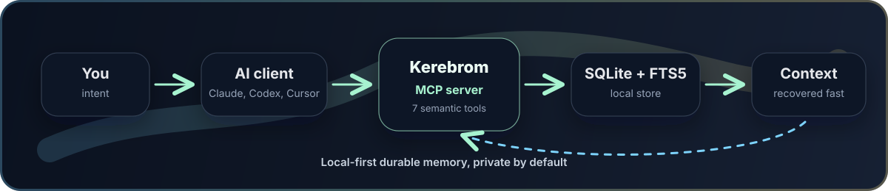

# Kerebrom

[Español](README.es.md) · [Release v1.0.8](https://github.com/ulianbass/kerebrom/releases/tag/v1.0.8) · [Repository history](docs/BRANCHES.md)

> Local-first persistent memory for AI agents.
> One durable memory layer for Claude, Codex, Cursor, Gemini CLI, OpenCode, Windsurf, VS Code, and other MCP-capable clients.

Kerebrom gives coding agents a shared local memory without sending your project context to a cloud service. It runs as a single Go binary, stores data in SQLite with FTS5, exposes an MCP server, and installs the strongest available memory workflow for each supported AI client.



## Product Line

The active public branch is `v1`. Historical implementation lines are kept as tags, ordered from oldest to newest:

| Line | Status | Purpose |
|---|---:|---|
| `history/legacy-main-2026-04-10` | tag | Legacy default-branch history before the v1 reset |
| `history/go-rewrite-2026-04-10` | tag | Previous Go rewrite experiment |
| `v1` | current branch | Stable v1 release line |

Kerebrom v1 lives under `versions/v1/` so future versions can evolve without rewriting history.

## What v1 Provides

- Single Go binary with no service stack to maintain.
- Shared local memory across supported AI agents.
- SQLite + FTS5 storage for fast local retrieval.
- MCP server with 15 `mem_*` tools and an agent profile that exposes only the tools agents need by default.
- MCP prompt/resource protocol for Claude Desktop and other MCP-only clients.
- Streamable HTTP MCP transport for remote connectors such as Claude Chat/Cowork and ChatGPT when the client cannot launch a local `stdio` MCP server.
- CLI, HTTP API, terminal dashboard, export/import, and compressed sync chunks.
- Claude Code lifecycle hooks for session start, prompt ingest, passive capture, compaction recovery, and session close.
- MCP and instruction setup for Codex, Claude Desktop, Cursor, Gemini CLI, OpenCode, Windsurf, and VS Code.
- Distilled memory framework: prompts are intent history; canonical observations are agent-interpreted `What / Why / Where / Learned` memories.

## Install From Source

```bash
git clone https://github.com/ulianbass/kerebrom.git
cd kerebrom/versions/v1
make install-user
```

This builds `kerebrom`, installs it to `~/local/bin/kerebrom`, links it from `~/.local/bin/kerebrom`, and runs:

```bash
kerebrom setup auto
```

`setup auto` configures only clients with existing local config, and falls back to Claude Desktop when no client config is detected. To force one client, run for example:

```bash
make install-user SETUP_AGENT=cursor
make install-user SETUP_AGENT=claude-desktop
make install-user SETUP_AGENT=all
```

Source installs build the checkout you cloned. A fresh clone of the default `v1` branch installs the current release line; an older clone should be updated before running the installer.

## Everyday Commands

```bash
kerebrom version
kerebrom setup auto
kerebrom setup all
kerebrom stats
kerebrom context --project my-project "what matters here?"
kerebrom search "release decision"
KEREBROM_REMOTE_TOKEN="change-me" kerebrom mcp-http --addr 127.0.0.1:7437 --path /mcp
kerebrom tui
kerebrom export --output memory-export.json
kerebrom sync --status
```

For agent integrations, most users should not call memory tools manually. Kerebrom registers MCP tools, a memory protocol prompt/resource, and client instructions so the agent can save prompts, retrieve context, and persist distilled learnings during normal work. Hook-capable clients such as Claude Code can run this per turn; MCP-only clients such as Claude Desktop receive the strongest behavior their MCP surface exposes. Cloud clients such as Claude Chat/Cowork and ChatGPT cannot launch the local binary directly: they need a user-hosted or cloud-hosted Kerebrom Streamable HTTP endpoint.

## Memory Model

Kerebrom separates four concepts:

| Object | Purpose |
|---|---|
| Project | Normalized workspace or domain boundary |
| Session | Lifecycle of a working conversation or agent run |
| Prompt | User intent history |
| Observation | Canonical durable memory, distilled by an AI agent |

Observations should not be raw transcripts. They should be concise, interpreted, and useful for future work.

## Architecture

```text
versions/v1/
  cmd/kerebrom/             CLI entrypoint
  internal/cli/             commands, hooks, TUI
  internal/setup/           local AI-client setup
  internal/store/sqlite/    SQLite + FTS5 memory store
  internal/transport/mcp/   MCP server
  internal/transport/http/  local HTTP API
  internal/sync/            compressed sync chunks
  docs/                     ADRs, spec, release checklist
```

Runtime data is stored in the user’s local Kerebrom data directory. The repository does not contain user memory, backups, machine-specific configuration, or migration staging material.

## Build And Test

```bash
cd versions/v1
make test
make build
./bin/kerebrom version
```

## Provenance

Kerebrom v1 is the clean v1 product line. It preserves the product direction and public repository identity while keeping previous experiments as history tags. See [docs/BRANCHES.md](docs/BRANCHES.md) for the repository map.

## License

Source-available proprietary software. See [LICENSE](LICENSE).
